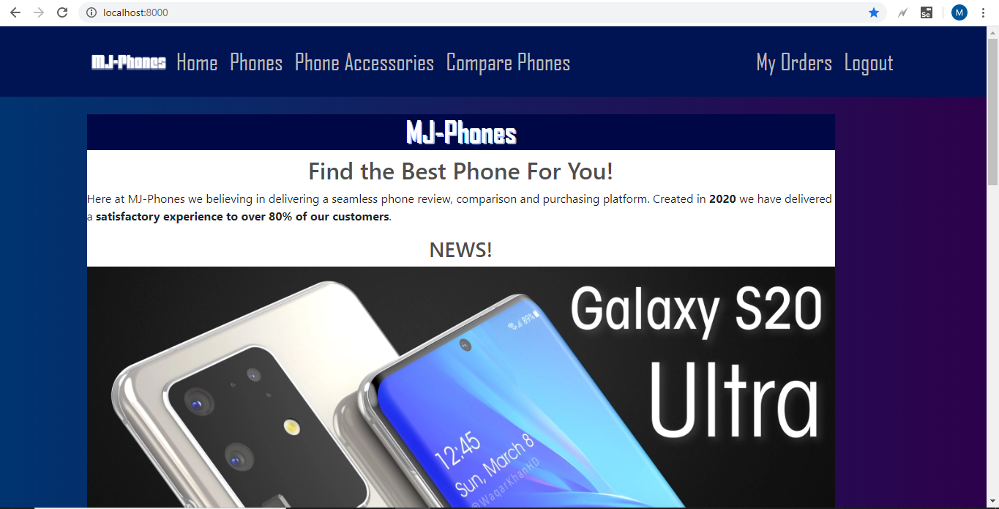
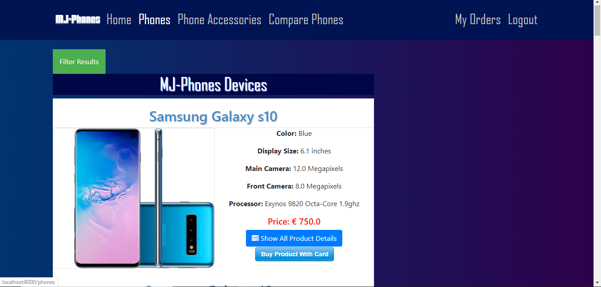
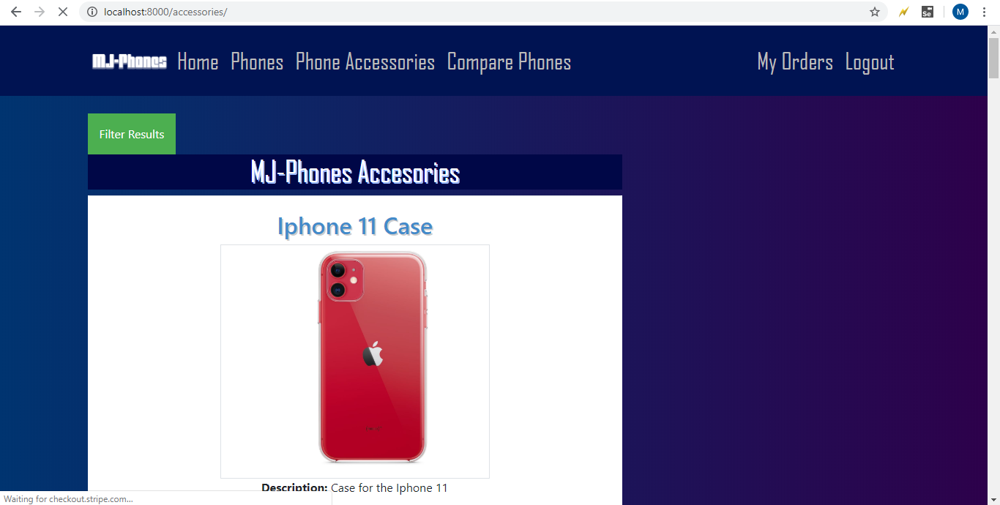
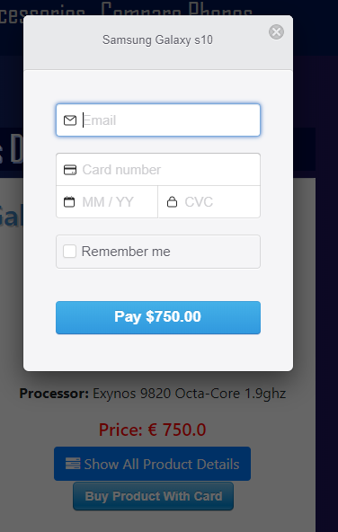
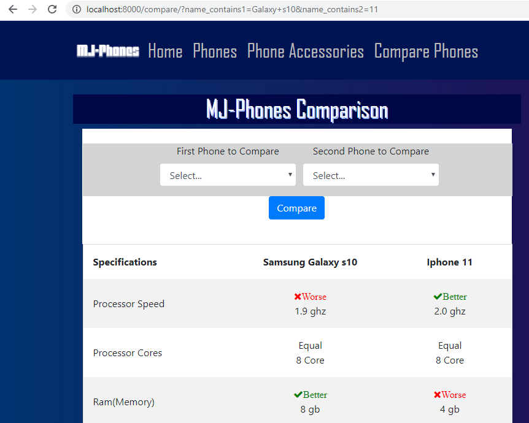
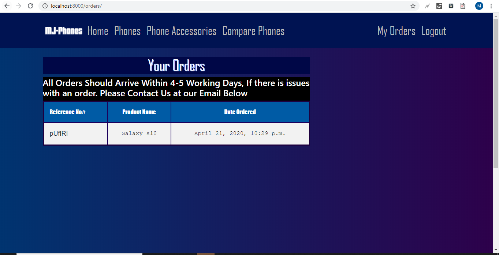
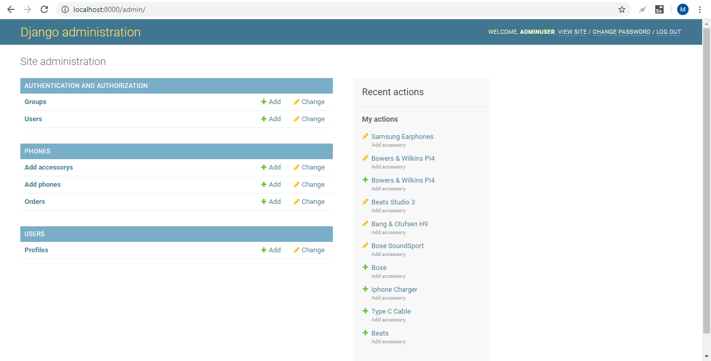

# MJ-Phones
This website made by Mateusz Pawlowski and James Porter. It's platform is ''Mobile Phone E-Commerce'' built upon Python's Django Framework.

# Screen-Cast Link (Youtube) 
This is the link to James's Youtube Screencast.
https://youtu.be/UUFtaGVKcAg
It gives a basic rundown of the project.

# About
Upon openening the website the user is presented the front page of the website. The main page is just a simple welcoming page, showing off a phone and some accessories. On the top of the site, there is a navbar which allows the user to manoeuvre through the other links. You can pick between home, phones, phones accessories, compare and depending on wheter you are logged in or not at the right hand side you will see login, register, logout and my orders. Each page is granted with the same css style and page layout. Managing the page each time in each html page we decided to create a base.html which stored all the basic css style and page layout and imported that into each page.  

When in phones, the user is presented with all the different Phones that he can buy from the website. Each phone has a button on the right hand side of the image allowing you to show the product details, or buy that specific phone. All the phones are created in the admin panel that django provides and we used SQL Lite to store the phones into a database. To read the phones we used a simple for loop in order to go through the entire database. When pressed 'show all product details' the user can see more information about the product he would like to purchase. Just on top of the page, below the navigational bar, there is a button called 'filter' and that as the name says can filter the database to your liking. We implemented this to let the users find the phones they might be looking for more smoothly and productively.  

We allowed the user not only to buy phones but also phone accessories, which include cases, cables, headphones etc. It is mostly like the phones page, where you can buy the product and filter to the user liking.  

For the payment method, we decided to use stripe. It is very similar to paypal and many companies use it such as Reddit, Udemy, Lyft, Monzo etc. Stripe has a sandbox feature which allows you to implement into the browser and test it without using a proper card. There are many **'test' cards** you can choose from, but we mainly tried: **4242 4242 4242 4242**. When the user picks the phone/accessory they want to buy and put in the details they are brought to the charge page where the user gets a message, the product will be delivered to their address shortly. However, **in order to buy a product the user has to be logged in**.  

Compare page gives the user a chance to pick two phones from the entire databse and compare the different features of the phone. When a phone has a better spec from the other one, it will show a green or red coloured arrow depending which one is better and worse.  

When logged out, user can register and create an account on the website which is then stored into an database. Once account created there is a log in function and the user can access his account by logging in with the proper account name and password. Whilst logged in then you can buy products. Another feature you are allowed to see is 'my orders' which shows all the users previous orders the user did on the account they are currently logged into.  

# Admin Panel and Default User
In order to access admin panel type in your browser: **localhost:8000/admin7.0.0.1:8000/admin**  
You will need to log in as a staff user. 

The user we have premade with admin priveledges is
**Username: AdminUser Password:Admin321**
you can also use James's Custom Made One
**Username: jay Password:123**

Default user: 
Django creates a admin panel by default. This made the whole project easier to handle and allowed us to focus on other parts of the project. Here in the admin panel we are allowed to add phones and accessories into the database, aswell as add users and edit users. A default user without the staff/admin role is not allowed to access the admin panel.  

# Requirements
A Requirements.txt File of all the Packages Installed on the Version of PIP we used for Django Project. Many of these should have been updated but that should not affect the project integrity unless they were majorly changed. If that happens, you will need to install a older/legacy version of that package in pip that is more related to the required packages below.

python==3.8.1  
asgiref==3.2.7  
certifi==2020.4.5.1  
chardet==3.0.4  
Django==3.0.5  
idna==2.9  
pytz==2019.3  
requests==2.23.0  
sqlparse==0.3.1  
stripe==2.45.0  
urllib3==1.25.8

# How to run
You need to download python 3.8.1  
Pip 19.2.3

Open command line  
To first run the application you have to clone the project  
**git clone https://github.com/JamesP1996/MJ-Phones**

Change the directory  
**cd Mj-Phones**  

install  
**pip install django**  
**pip install stripe**

run the server  
**python manage.py runserver**

open broswer and type
**localhost:8000 or 127.0.0.1:8000**

# Tests Done With Selenium IDE for Chrome
Compare Phones - **Pass**  
Filter Phones - **Pass**  
Filter Accessories - **Pass**  
Login - **Pass**  
AdminPanel - **Pass**  
Show Details - **Pass** 

Tests can be ran in your own **Selenium IDE** by going into tests folder and downloading the .side file.

# Built with
[Python](https://www.python.org/) - Language used  
[Django](https://www.djangoproject.com/) - Web framework used  
[SQL Lite](https://www.sqlite.org/index.html) - Database used  
[Stripe](https://stripe.com/docs/testing) - Payment method

# Authors
**Mateusz Pawlowski**  
**James Porter**
